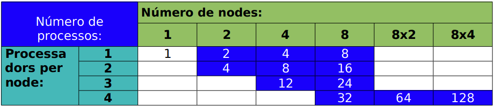

# CPM_P2.2

## Connection commands

### Open tunnel
`ssh -NL 8283:zoo.lab.deim:22    NIF@portal1-deim.urv.cat`

### Connect
`ssh -X -p 8283 NIF@localhost`

### Send 
`scp -P 8283 <file> NIF@localhost:.`

## Execution commands
Command for execute program in pop machine with **max 8 nodes**

`salloc -p pop -N 8 -n 32 time mpirun -n 'Numero de processos' --npernode "Processadors_per_node' --oversubscribe ./mpi`

Command for execute program in pop machine with **more than 8 nodes**

`salloc -p pop -N 8 -n 32 time mpirun -n 64 --mca mpi_yield_when_idle true --oversubscribe ./mpi`

`salloc -p pop -N 8 -n 32 time mpirun -n 128 --mca mpi_yield_when_idle true --oversubscribe ./mpi`